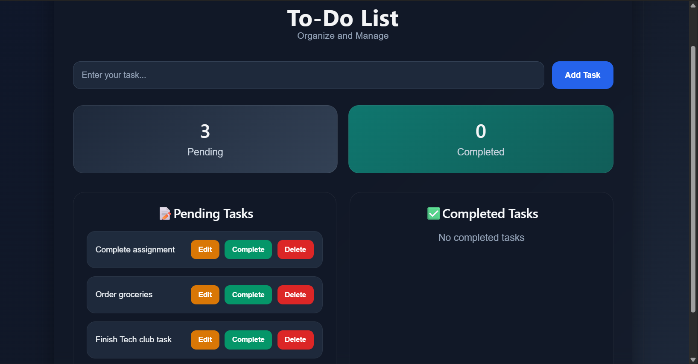
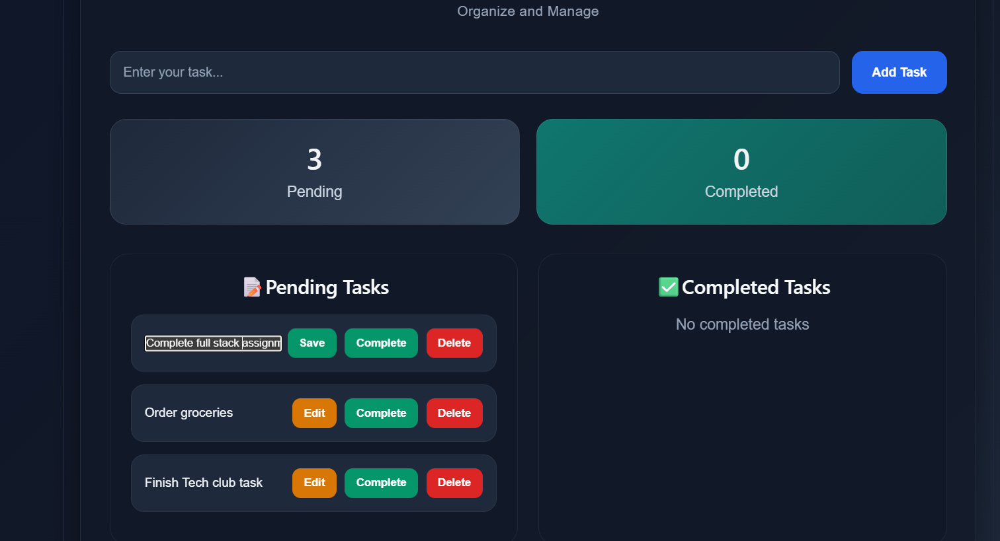
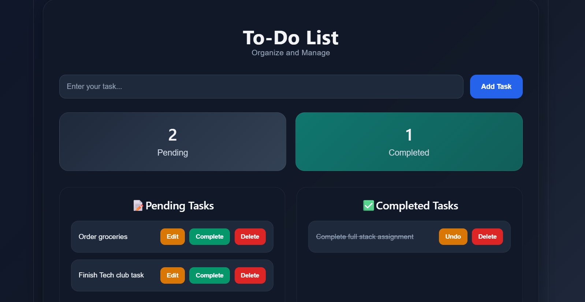
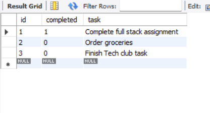

# Full Stack To-do List Application

A modern Full Stack To-do List Management Application built using React, Spring Boot, and MySQL.  
This project allows users to create, update, complete, edit, and delete tasks with real-time frontend and backend synchronization.

---

## Features

- Add new tasks
- Edit existing tasks
- Mark tasks as completed
- Undo completed tasks
- Delete tasks
- Separate Pending and Completed sections
- Responsive modern UI
- Full CRUD operations
- MySQL database integration

---

## Technologies Used

### Frontend
- React.js
- Vite
- Axios
- CSS3

### Backend
- Spring Boot
- Spring Data JPA
- Hibernate
- REST API

### Database
- MySQL

---

## Project Structure

```txt
todo-fullstack-app/
│
├── frontend/
│   ├── src/
│   ├── public/
│   ├── package.json
│   └── ...
│
├── backend/
│   ├── src/
│   ├── pom.xml
│   └── ...
│
└── README.md
```

---

## Frontend Setup

### Navigate to frontend folder

```bash
cd frontend
```

### Install dependencies

```bash
npm install
```

### Start frontend server

```bash
npm run dev
```

Frontend runs on:

```txt
http://localhost:5173
```

---

## Backend Setup

### Navigate to backend folder

```bash
cd backend
```

### Configure MySQL

Create a database in MySQL:

```sql
CREATE DATABASE tododb;
```

### Configure application.properties

```properties
spring.datasource.url=jdbc:mysql://localhost:3306/tododb
spring.datasource.username=root
spring.datasource.password=

spring.jpa.hibernate.ddl-auto=update
spring.jpa.show-sql=true
```

### Run Spring Boot Application

```bash
.\mvnw spring-boot:run
```

Backend runs on:

```txt
http://localhost:8080
```

---

## API Endpoints

| Method | Endpoint | Description |
|--------|----------|-------------|
| GET | /todos | Fetch all todos |
| POST | /todos | Add new todo |
| PUT | /todos/{id} | Toggle completion |
| PUT | /todos/edit/{id} | Edit todo |
| DELETE | /todos/{id} | Delete todo |

---

## CRUD Operations

### Create

Add new todo tasks.

### Read

Fetch all tasks from database.

### Update

Edit task text or toggle completion status.

### Delete

Remove task permanently from database.

---

## UI Features

- Dark modern aesthetic UI
- Responsive layout
- Smooth hover effects
- Organized task sections
- Statistics cards
- Interactive buttons

---

## Learning Outcomes

- React State Management
- React Hooks
- REST API Integration
- Axios HTTP Requests
- Spring Boot REST Controllers
- JPA Repository Usage
- MySQL Database Connectivity
- Full Stack CRUD Operations

---
## Application Screenshots

### Pending Tasks Section



---

### Edit Task Feature



---

### Completed Tasks Section



---

### SQL DATABASE



---

